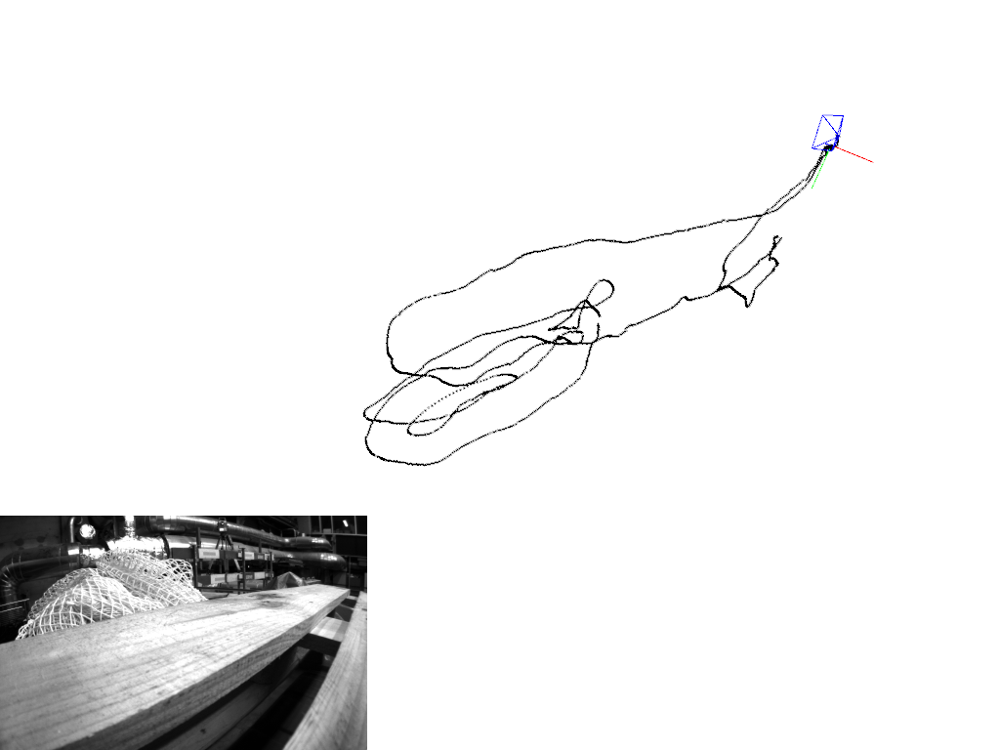

MSCKF (Multi-State Constraint Kalman Filter) is an EKF based **tightly-coupled** visual-inertial odometry algorithm. [S-MSCKF](https://arxiv.org/abs/1712.00036) is MSCKF's stereo version. 

For algorithm details, please refer to:
* Robust Stereo Visual Inertial Odometry for Fast Autonomous Flight, Ke Sun et al. (2017)
* A Multi-State Constraint Kalman Filterfor Vision-aided Inertial Navigation, Anastasios I. Mourikis et al. (2006)  

## Requirements
* Python 3.6+
* numpy
* scipy
* cv2
* [pangolin](https://github.com/uoip/pangolin) (optional, for trajectory/poses visualization)

## Dataset
* [EuRoC MAV](http://projects.asl.ethz.ch/datasets/doku.php?id=kmavvisualinertialdatasets): visual-inertial datasets collected on-board a MAV. The datasets contain stereo images, synchronized IMU measurements, and ground-truth.  
This project implements data loader and data publisher for EuRoC MAV dataset.

## Run  
`python vio.py --view --path path/to/your/EuRoC_MAV_dataset/MH_01_easy`  
or    
`python vio.py --path path/to/your/EuRoC_MAV_dataset/MH_01_easy` (no visualization)  

## For DEEP Visual Inertial Odometry Set training data and run the following command to train the network

`python train.py --images <Path to the images folder> --IMU <path to imu data> --rotations<path to relative pose data> --minibatch <Minibatch size> --epochs <Number of epochs> --lr <Learning rate> --latestmodelpath <folder to load checkpoint and start training from that epoch> --checkpointpath <where should the checkpoints save> --logspath <where the tensorlogs should save> --model <which model to run>`

## to run the inference model set inference data and run the following command

`python test.py --images <Path to the images folder> --IMU <path to imu data> --rotations<path to relative pose data> --minibatch <Minibatch size> --latestmodelpath <which model to load> --model <which model to run> --groundtruth <path to ground truth data>`

## Results
MH_01_easy  

## License and References
Follow [license of msckf_vio](https://github.com/KumarRobotics/msckf_vio/blob/master/LICENSE.txt). Code is adapted from [this implementation](https://github.com/uoip/stereo_msckf).

